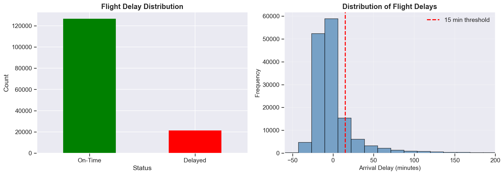
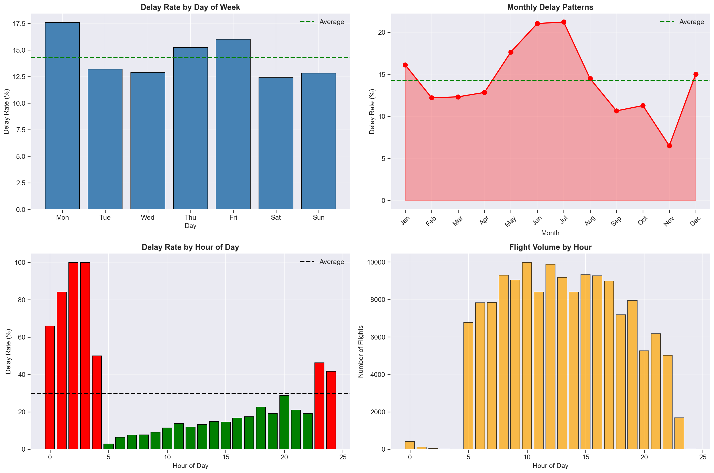
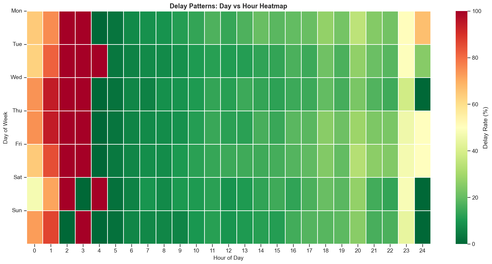
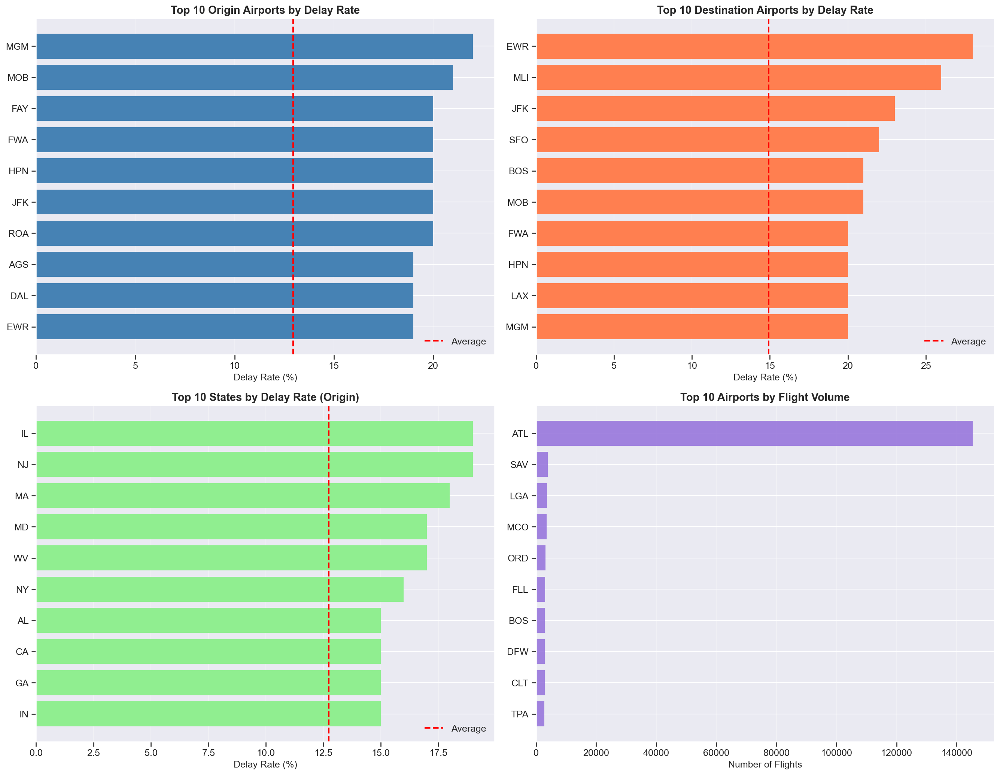
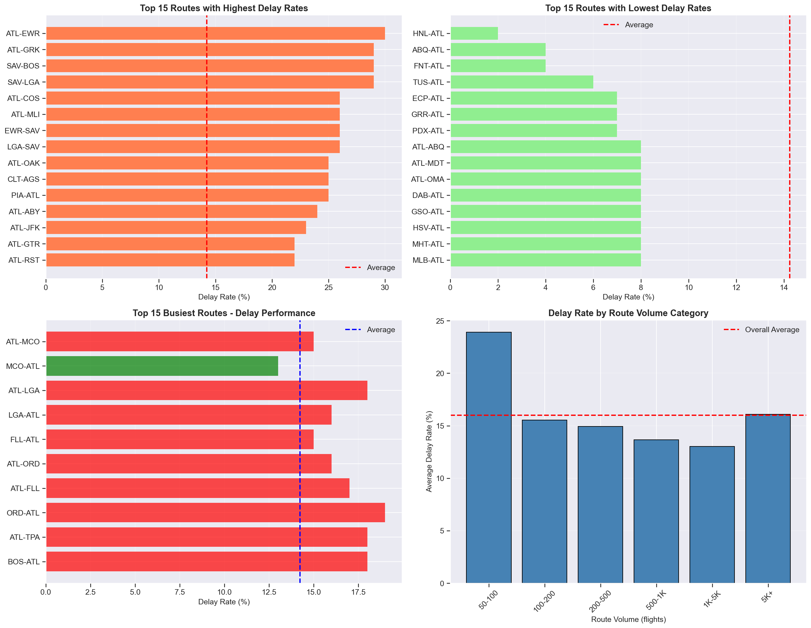
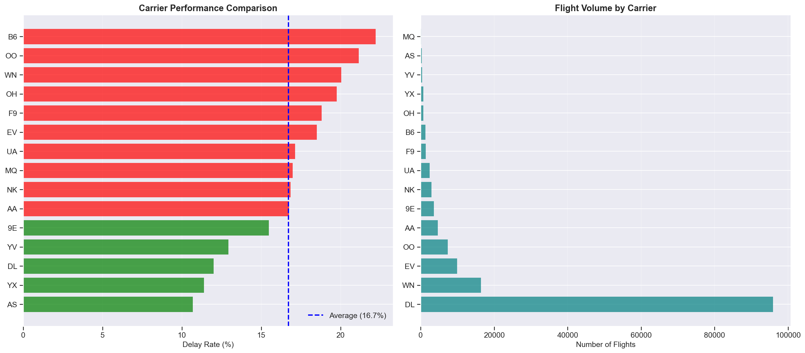
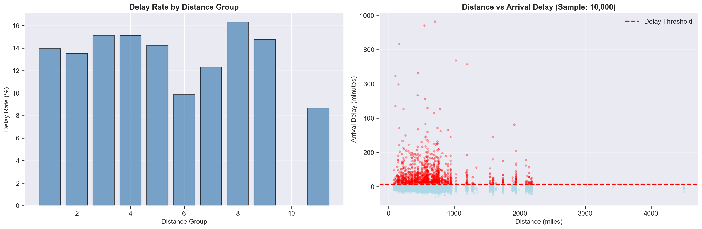
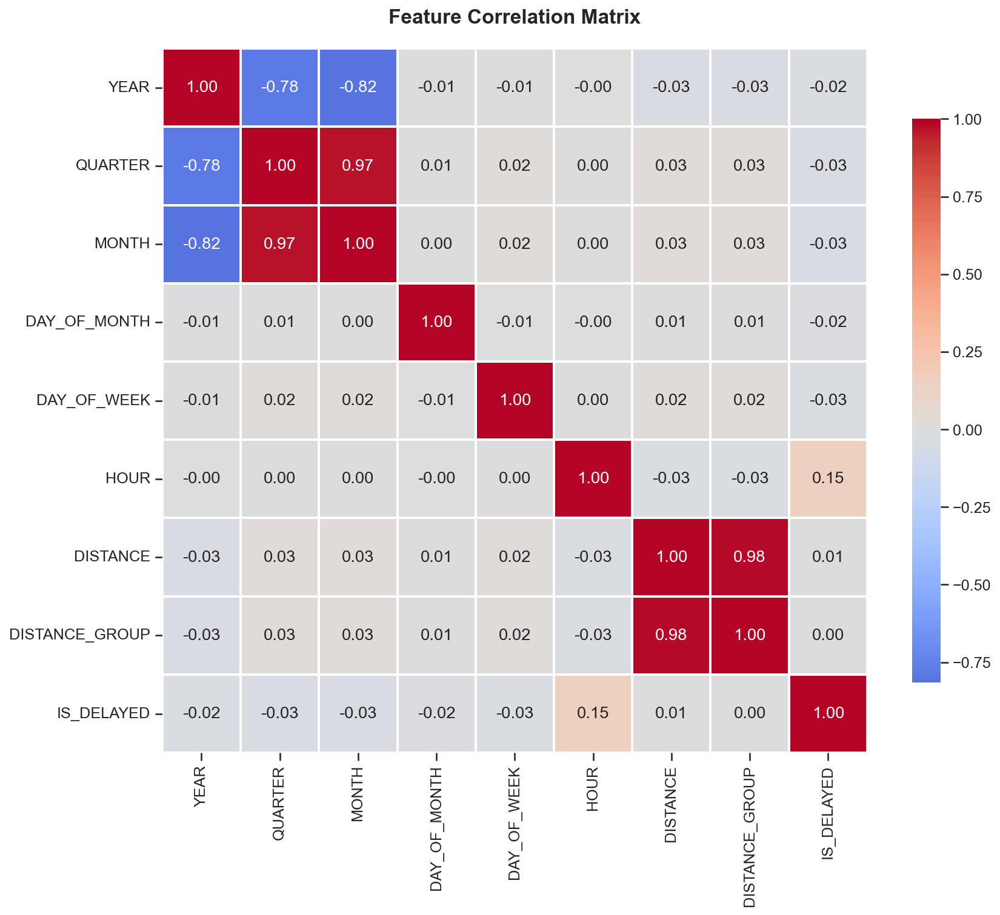
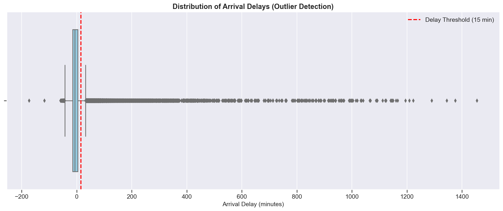

# 1. Data Exploration & Analysis

## 1.1 Dataset Overview

The dataset contains domestic U.S. flight records from 2017–2018, focusing on completed flights with valid arrival delay information. 

A binary target variable was defined using a 15-minute arrival delay threshold, consistent with industry standards used in airline performance reporting.

---

## 1.2 Delay Distribution and Class Imbalance

The delay distribution is highly imbalanced. Approximately **85–87% of flights arrive on time**, while only **13–15% are delayed** by 15 minutes or more.  

The arrival delay histogram shows a long right tail, with rare but severe delays extending several hours. This confirms that flight delays are infrequent but impactful events, motivating the use of precision–recall–based evaluation metrics during modeling.

---

## 1.3 Temporal Patterns

Delays are more frequent on **Mondays, Thursdays, and Fridays**, indicating higher congestion during business travel periods. Weekends, particularly Saturdays, show the lowest delay rates.

Monthly analysis reveals strong seasonality:
- Delay rates peak during **late spring and summer (May–July)**
- Lowest delay rates occur in **November**
- A secondary increase appears in December due to holiday travel

---

## 1.4 Day–Hour Interaction Effects

The heatmap highlights compound effects:
- Weekday evenings experience the highest delays
- Early mornings remain consistently reliable across all days

These interactions justify the inclusion of time-of-day and weekday interaction features.

---

## 1.5 Airport and Geographic Patterns

Certain airports and states consistently exhibit higher delay rates independent of traffic volume. Large hub airports dominate flight volume but are not always the worst performers in delay percentage, suggesting operational efficiency differences.

---

## 1.6 Route-Level Analysis

Delay rates vary significantly by route. Some high-volume routes perform better than average, while certain low-volume routes experience elevated delays. This motivated route-level historical risk features.

---

## 1.7 Carrier Performance

Carriers show distinct delay profiles. High-volume carriers are not necessarily the worst performers, while smaller carriers display higher volatility. This supports the inclusion of carrier-level historical features.

---

## 1.8 Distance and Delay Relationship

Distance alone shows weak linear correlation with delay probability. However, long-haul flights display greater variability and extreme delays, particularly when combined with seasonal effects.

---

## 1.9 Correlation and Anomaly Analysis

Most individual features exhibit weak linear correlation with the delay outcome, reinforcing the need for non-linear modeling approaches.

Extreme delays are rare but genuine operational events. These outliers were retained to preserve real-world behavior.

---
# 2. Machine Learning Model Development

## 2.1 Target Definition

The prediction target is a **binary flight delay indicator**, defined as:

> **Delayed = 1 if arrival delay ≥ 15 minutes, else 0**

This definition follows standard U.S. Department of Transportation and airline industry benchmarks for operational delays.

The resulting dataset is **class-imbalanced**, with delayed flights representing approximately **13–15%** of total observations.

---

## 2.2 Feature Engineering Strategy

Feature engineering was designed with two core principles:

1. Capture operational and historical drivers of flight delays  
2. Prevent target leakage and preserve deployment realism  

### Feature Groups

**Temporal Features**
- Month, day of week, quarter
- Departure hour binned into operational windows (e.g., `6–8`, `9–11`, `18–20`)
- Weekend, summer, winter, and holiday-season indicators

**Route & Carrier Identifiers**
- Origin airport
- Destination airport
- Route (`ORIGIN–DEST`)
- Carrier
- Carrier–route interaction (`CARRIER_ORIGIN–DEST`)

**Traffic & Hub Indicators**
- Hub airport flags (origin, destination, hub-to-hub)
- Busy-airport indicators
- Route popularity and traffic proxies

**Distance-Based Features**
- Raw distance (miles)
- Normalized distance
- Distance categories (Short / Medium / Long)
- Haul-type indicators (short-haul, medium-haul, long-haul)

**Historical Risk & Volume Encodings**
- Historical delay rates for:
  - Origin airport
  - Destination airport
  - Carrier
  - Route
  - Carrier–route
- Training-only count statistics for the same entities

> **Leakage Prevention**  
> All historical risk and count features were computed **only on the training split** and persisted as lookup tables.  
> Test and inference-time predictions reference these precomputed values exclusively, ensuring strict separation between training and evaluation data.

---

## 2.3 Models Implemented

Three supervised classification models were developed and compared:

- **Logistic Regression**
  - Interpretable baseline
  - Strong probability calibration
  - Limited non-linear modeling capacity

- **XGBoost**
  - Non-linear tree-based model
  - Requires explicit categorical encoding
  - Competitive performance with additional preprocessing

- **CatBoost (Selected Model)**
  - Native handling of categorical features
  - Robust to high-cardinality route and carrier variables
  - Reduced preprocessing complexity and improved stability

### Train/Test Split Strategy

A **time-based split** was used instead of random sampling:

- Training data: earlier time periods
- Test data: later, unseen periods

This approach reflects real-world deployment and prevents temporal leakage.

---

# 3. Model Evaluation & Selection

## 3.1 Evaluation Metrics and Business Rationale

Flight delay prediction is an **imbalanced classification problem**, making accuracy an unsuitable metric.

To evaluate performance meaningfully, the following metrics were used:

- **Precision–Recall AUC (PR-AUC)** *(primary metric)*  
  Measures performance on the minority (delayed) class and reflects the model’s ability to identify risky flights.

- **ROC-AUC** *(secondary metric)*  
  Evaluates overall ranking performance across thresholds.

- **Brier Score**  
  Assesses probability calibration and reliability, which is critical for user-facing risk estimates.

This metric combination ensures both **discriminative power** and **probability quality**.

---

## 3.2 Model Comparison

| Model | ROC-AUC | PR-AUC | Brier Score |
|------|--------|--------|-------------|
| **CatBoost** | **0.693** | **0.299** | 0.186 |
| XGBoost | 0.679 | 0.290 | 0.180 |
| Logistic Regression | 0.672 | 0.279 | **0.109** |

CatBoost achieved the strongest PR-AUC and overall ranking performance, making it the most effective model for identifying delayed flights.

---

## 3.3 Threshold Selection

Rather than using a default probability cutoff of 0.50, an operating threshold of **0.30** was selected based on validation analysis.

This threshold provides:
- **High recall (~90%)**, minimizing missed delayed flights
- Acceptable false positives for a decision-support application

### Business Rationale

- Missing a delayed flight is more costly than flagging a potential delay
- The application communicates **risk**, not certainty
- Conservative alerts support proactive traveler decision-making

---

## 3.4 Probability Calibration

Tree-based models such as CatBoost tend to produce **overconfident probability estimates**.  
To address this, **Platt Scaling (sigmoid calibration)** was applied:

- A held-out calibration set was used
- Raw model probabilities were converted to log-odds
- A logistic regression calibrator was trained on these values

Calibration improved probability reliability and produced smoother, more realistic risk distributions for UI consumption.

---

# 4. Model Interpretation & Insights

## 4.1 Key Factors Influencing Delays

Key contributors include:
- Historical delay behavior of routes, carriers, and airports
- Time-of-day congestion effects
- Seasonal travel demand
- Hub-to-hub routing patterns

Delays arise from interacting operational factors rather than a single dominant cause.

---

## 4.2 User-Facing Insights

The model enables actionable insights such as:
- Higher delay risk for late-afternoon departures
- Persistent reliability differences across routes
- Seasonal congestion warnings

---

## 4.3 Translation into App Features

These insights can be translated into:
- Delay risk scores during booking
- Proactive delay alerts
- Buffer time recommendations for connections
- Time-of-day travel suggestions

---

# 5. Limitations 

Limitations include the absence of weather, air traffic control, and aircraft rotation data. Future work could integrate real-time operational data to further improve predictive performance.

---

# Conclusion

This project demonstrates an end-to-end, approach to flight delay prediction, combining exploratory analysis, leakage-safe feature engineering, robust modeling, and interpretable insights suitable for in a travel application.
